# LAPORAN MAGANG
## Sistem Analisis Sentimen Publik Terhadap PT Pupuk Iskandar Muda Menggunakan Algoritma Naive Bayes

---

## 📋 Informasi Proyek

| Item | Keterangan |
|------|------------|
| **Nama Sistem** | SentimenPIM - Sistem Analisis Sentimen Publik |
| **Objek Penelitian** | PT Pupuk Iskandar Muda (PIM) |
| **Algoritma** | Naive Bayes Classifier |
| **Feature Extraction** | TF-IDF Vectorizer |
| **Frontend** | React + Vite + TypeScript + Tailwind CSS |
| **Backend** | Flask Python REST API |
| **Database** | CSV (data_sentimen.csv, data_bersih.csv) |

---

## 🏗️ Arsitektur Sistem


---

## 📊 Use Case Diagram

### Use Case Diagram Lengkap dengan Include & Extend

```mermaid
flowchart TB
    %% Actors
    User((👤 User/Pengguna))
    Admin((👨‍💼 Admin/Developer))
    
    %% Main Use Cases
    UC1[🏠 Lihat Dashboard]
    UC2[📝 Analisis Teks Baru]
    UC3[📁 Lihat Dataset]
    UC4[📈 Lihat Evaluasi Model]
    UC5[☁️ Lihat Word Cloud]
    UC6[ℹ️ Lihat Tentang Sistem]
    
    %% Include Use Cases
    UC1_1[📊 Ambil Statistik Sentimen]
    UC1_2[📋 Ambil Feed Mention]
    UC2_1[🔧 Preprocessing Teks]
    UC2_2[🎯 Prediksi Sentimen]
    UC2_3[📉 Hitung Probabilitas]
    UC4_1[🧮 Hitung Metrics]
    UC4_2[📐 Generate Confusion Matrix]
    
    %% Extend Use Cases
    UC1_E1[🔍 Filter by Sentimen]
    UC3_E1[📤 Export Dataset CSV]
    UC3_E2[🔎 Cari Data]
    UC3_E3[📑 Pagination]
    UC5_E1[🎨 Filter Word Cloud by Sentimen]
    
    %% Admin Use Cases
    UC_A1[🔄 Training Model]
    UC_A2[🧹 Preprocessing Dataset]
    UC_A3[✅ Evaluasi Model]
    
    %% User connections
    User --> UC1
    User --> UC2
    User --> UC3
    User --> UC4
    User --> UC5
    User --> UC6
    
    %% Admin connections
    Admin --> UC_A1
    Admin --> UC_A2
    Admin --> UC_A3
    
    %% Include relationships
    UC1 -.->|≪include≫| UC1_1
    UC1 -.->|≪include≫| UC1_2
    UC2 -.->|≪include≫| UC2_1
    UC2 -.->|≪include≫| UC2_2
    UC2 -.->|≪include≫| UC2_3
    UC4 -.->|≪include≫| UC4_1
    UC4 -.->|≪include≫| UC4_2
    
    %% Extend relationships
    UC1_E1 -.->|≪extend≫| UC1
    UC3_E1 -.->|≪extend≫| UC3
    UC3_E2 -.->|≪extend≫| UC3
    UC3_E3 -.->|≪extend≫| UC3
    UC5_E1 -.->|≪extend≫| UC5
    
    %% Admin includes
    UC_A1 -.->|≪include≫| UC_A2
    UC_A3 -.->|≪include≫| UC4_1
```

### Deskripsi Use Case

#### Use Case Utama

| No | Use Case | Aktor | Deskripsi |
|----|----------|-------|-----------|
| UC1 | Lihat Dashboard | User | Melihat ringkasan statistik sentimen dan visualisasi |
| UC2 | Analisis Teks Baru | User | Menganalisis sentimen dari teks yang diinputkan |
| UC3 | Lihat Dataset | User | Melihat dan mencari data training sentimen |
| UC4 | Lihat Evaluasi Model | User | Melihat performa dan akurasi model |
| UC5 | Lihat Word Cloud | User | Melihat visualisasi kata-kata dominan |
| UC6 | Lihat Tentang Sistem | User | Melihat informasi tentang sistem |

#### Use Case Include (Wajib)

| No | Use Case | Parent | Deskripsi |
|----|----------|--------|-----------|
| UC1.1 | Ambil Statistik Sentimen | UC1 | Mengambil data statistik dari API |
| UC1.2 | Ambil Feed Mention | UC1 | Mengambil daftar mention terbaru |
| UC2.1 | Preprocessing Teks | UC2 | Membersihkan dan memproses input teks |
| UC2.2 | Prediksi Sentimen | UC2 | Melakukan prediksi dengan model NB |
| UC2.3 | Hitung Probabilitas | UC2 | Menghitung confidence score |
| UC4.1 | Hitung Metrics | UC4 | Menghitung accuracy, precision, recall, F1 |
| UC4.2 | Generate Confusion Matrix | UC4 | Membuat matrix confusion |

#### Use Case Extend (Opsional)

| No | Use Case | Parent | Kondisi |
|----|----------|--------|---------|
| UC1.E1 | Filter by Sentimen | UC1 | User ingin melihat sentimen tertentu |
| UC3.E1 | Export Dataset CSV | UC3 | User ingin mengunduh data |
| UC3.E2 | Cari Data | UC3 | User ingin mencari teks tertentu |
| UC3.E3 | Pagination | UC3 | Data lebih dari 1 halaman |
| UC5.E1 | Filter Word Cloud | UC5 | User filter berdasarkan sentimen |

---

## 📈 Data Flow Diagram (DFD)

### DFD Level 0 - Context Diagram

```mermaid
flowchart LR
    User((👤 User))
    
    System[["0.0
    Sistem Analisis
    Sentimen PIM"]]
    
    DS1[(Dataset Sentimen)]
    DS2[(Model ML)]
    
    User -->|Input Teks| System
    User -->|Request Data| System
    System -->|Hasil Analisis| User
    System -->|Statistik & Visualisasi| User
    
    DS1 <-->|Read/Write| System
    DS2 <-->|Load Model| System
```

### DFD Level 1 - Diagram Sistem Utama

```mermaid
flowchart TB
    User((👤 User))
    
    P1["1.0
    Proses
    Analisis Sentimen"]
    
    P2["2.0
    Proses
    Dashboard"]
    
    P3["3.0
    Proses
    Manajemen Dataset"]
    
    P4["4.0
    Proses
    Evaluasi Model"]
    
    P5["5.0
    Proses
    Word Cloud"]
    
    DS1[(D1: data_sentimen.csv)]
    DS2[(D2: data_bersih.csv)]
    DS3[(D3: model_nb.pkl)]
    DS4[(D4: vectorizer.pkl)]
    
    %% User to Process
    User -->|"Input Teks"| P1
    User -->|"Request Dashboard"| P2
    User -->|"Request Dataset"| P3
    User -->|"Request Evaluasi"| P4
    User -->|"Request WordCloud"| P5
    
    %% Process to User
    P1 -->|"Hasil Sentimen + Confidence"| User
    P2 -->|"Statistik + Chart"| User
    P3 -->|"Data Tabel"| User
    P4 -->|"Metrics + Matrix"| User
    P5 -->|"Word Frequencies"| User
    
    %% Data Stores
    DS1 --> P2
    DS1 --> P3
    DS1 --> P5
    DS2 --> P4
    DS3 --> P1
    DS3 --> P4
    DS4 --> P1
    DS4 --> P4
```

### DFD Level 2 - Proses Analisis Sentimen (Detail)

```mermaid
flowchart TB
    User((👤 User))
    
    P1_1["1.1
    Terima &
    Validasi Input"]
    
    P1_2["1.2
    Preprocessing
    Teks"]
    
    P1_3["1.3
    Vektorisasi
    TF-IDF"]
    
    P1_4["1.4
    Prediksi
    Naive Bayes"]
    
    P1_5["1.5
    Hitung
    Probabilitas"]
    
    P1_6["1.6
    Format
    Response"]
    
    DS_Vec[(vectorizer.pkl)]
    DS_Model[(model_nb.pkl)]
    
    User -->|"Teks Mentah"| P1_1
    P1_1 -->|"Teks Valid"| P1_2
    P1_2 -->|"Clean Text"| P1_3
    DS_Vec --> P1_3
    P1_3 -->|"TF-IDF Vector"| P1_4
    DS_Model --> P1_4
    P1_4 -->|"Label Prediksi"| P1_5
    P1_4 -->|"Raw Probabilities"| P1_5
    P1_5 -->|"Confidence Score"| P1_6
    P1_6 -->|"JSON Response"| User
```

### DFD Level 2 - Proses Training Model

```mermaid
flowchart TB
    Admin((👨‍💼 Admin))
    
    P_T1["T.1
    Load Dataset
    CSV"]
    
    P_T2["T.2
    Preprocessing
    - Lowercase
    - Remove Special Char
    - Tokenization
    - Stopword Removal"]
    
    P_T3["T.3
    Split Data
    Train/Test
    (80/20)"]
    
    P_T4["T.4
    Fit TF-IDF
    Vectorizer"]
    
    P_T5["T.5
    Training
    Naive Bayes"]
    
    P_T6["T.6
    Evaluasi &
    Simpan Model"]
    
    DS1[(data_sentimen.csv)]
    DS2[(data_bersih.csv)]
    DS3[(model_nb.pkl)]
    DS4[(vectorizer.pkl)]
    
    Admin -->|"Trigger Training"| P_T1
    DS1 --> P_T1
    P_T1 -->|"Raw Data"| P_T2
    P_T2 -->|"Clean Data"| DS2
    P_T2 -->|"Clean Data"| P_T3
    P_T3 -->|"Train Set"| P_T4
    P_T3 -->|"Test Set"| P_T6
    P_T4 -->|"Vectorizer"| DS4
    P_T4 -->|"Vectors"| P_T5
    P_T5 -->|"Trained Model"| P_T6
    P_T6 -->|"Model File"| DS3
    P_T6 -->|"Metrics Report"| Admin
```

---

## 🔄 Activity Diagram

### Activity Diagram - Analisis Sentimen Teks


### Activity Diagram - Training Model

```mermaid
flowchart TD
    Start([🟢 Start])
    End([🔴 End])
    
    T1[Admin jalankan preprocessing.py]
    T2[Load data_sentimen.csv]
    T3[Download NLTK data]
    
    subgraph Preprocessing["🔧 Preprocessing Loop"]
        P1[Ambil teks dari baris]
        P2[Lowercase conversion]
        P3[Hapus karakter khusus dengan regex]
        P4[Tokenisasi dengan word_tokenize]
        P5[Load Indonesian stopwords]
        P6[Hapus stopwords dari tokens]
        P7[Gabung tokens menjadi clean_text]
        P8{Masih ada baris?}
    end
    
    T4[Simpan ke data_bersih.csv]
    T5[Admin jalankan training.py]
    T6[Load data_bersih.csv]
    T7[Pisahkan X clean_text dan y label]
    T8[Inisialisasi TfidfVectorizer]
    T9[fit_transform pada X]
    T10[train_test_split 80/20]
    T11[Inisialisasi MultinomialNB]
    T12[fit model dengan X_train, y_train]
    T13[Hitung akurasi pada test set]
    T14[Simpan model_nb.pkl]
    T15[Simpan vectorizer.pkl]
    T16[Print hasil akurasi]
    
    Start --> T1
    T1 --> T2
    T2 --> T3
    T3 --> P1
    P1 --> P2
    P2 --> P3
    P3 --> P4
    P4 --> P5
    P5 --> P6
    P6 --> P7
    P7 --> P8
    P8 -->|Ya| P1
    P8 -->|Tidak| T4
    T4 --> T5
    T5 --> T6
    T6 --> T7
    T7 --> T8
    T8 --> T9
    T9 --> T10
    T10 --> T11
    T11 --> T12
    T12 --> T13
    T13 --> T14
    T14 --> T15
    T15 --> T16
    T16 --> End
```

### Activity Diagram - Lihat Dashboard

```mermaid
flowchart TD
    Start([🟢 Start])
    End([🔴 End])
    
    D1[User membuka Dashboard]
    D2[Set loading = true]
    
    subgraph Parallel["⚡ Parallel API Calls"]
        API1[GET /api/stats]
        API2[GET /api/mentions]
        API3[GET /api/wordcloud]
    end
    
    D3{Semua berhasil?}
    D4[Tampilkan error state]
    D5[Parse semua response]
    D6[Render Stat Cards dengan stagger animation]
    D7[Render Sentiment Chart]
    D8[Render Word Cloud]
    D9[Render Mention Feed]
    D10[Set loading = false]
    
    Start --> D1
    D1 --> D2
    D2 --> API1
    D2 --> API2
    D2 --> API3
    API1 --> D3
    API2 --> D3
    API3 --> D3
    
    D3 -->|Error| D4
    D4 --> End
    
    D3 -->|Success| D5
    D5 --> D6
    D6 --> D7
    D7 --> D8
    D8 --> D9
    D9 --> D10
    D10 --> End
```

---

## 🔀 Sequence Diagram

### Sequence Diagram - Analisis Sentimen

```mermaid
sequenceDiagram
    autonumber
    
    actor User as 👤 User
    participant FE as 🖥️ Frontend<br/>(React)
    participant API as ⚙️ Flask API<br/>(/api/analyze)
    participant VEC as 📊 TF-IDF<br/>Vectorizer
    participant NB as 🤖 Naive Bayes<br/>Model
    
    User->>FE: Input teks & klik Analisis
    activate FE
    
    FE->>FE: Validasi input (tidak kosong)
    FE->>FE: Set loading = true
    
    FE->>+API: POST /api/analyze<br/>{"text": "teks input"}
    
    API->>API: Terima request JSON
    API->>+VEC: Load vectorizer.pkl
    VEC-->>-API: Vectorizer ready
    
    API->>+VEC: vectorizer.transform([text])
    VEC-->>-API: TF-IDF Vector (sparse matrix)
    
    API->>+NB: Load model_nb.pkl
    NB-->>-API: Model ready
    
    API->>+NB: model.predict(vector)
    NB-->>-API: predicted_label ("positif")
    
    API->>+NB: model.predict_proba(vector)
    NB-->>-API: probabilities [0.1, 0.2, 0.7]
    
    API->>API: Hitung confidence = max(proba)
    API->>API: Map index ke label sentimen
    
    API-->>-FE: Response JSON<br/>{"sentiment": "positif",<br/>"confidence": 0.85,<br/>"probabilities": {...}}
    
    FE->>FE: Set loading = false
    FE->>FE: Set result state
    
    FE->>User: Render Result Card<br/>- Badge Sentimen ✅<br/>- Confidence Bar 📊<br/>- Probability Chart 📈
    
    deactivate FE
```

### Sequence Diagram - Dashboard Load

```mermaid
sequenceDiagram
    autonumber
    
    actor User as 👤 User
    participant FE as 🖥️ Frontend
    participant API as ⚙️ Flask API
    participant DS as 💾 Dataset CSV
    
    User->>FE: Buka halaman Dashboard
    activate FE
    
    FE->>FE: Set loading = true
    
    par Parallel API Calls
        FE->>+API: GET /api/stats
        API->>+DS: Baca data_sentimen.csv
        DS-->>-API: DataFrame
        API->>API: Hitung total, positif, negatif, netral
        API-->>-FE: {"total": 500, "positif": 200, ...}
    and
        FE->>+API: GET /api/mentions?page=1
        API->>+DS: Baca data_sentimen.csv
        DS-->>-API: DataFrame
        API->>API: Paginate & add confidence
        API-->>-FE: {"data": [...], "total": 500}
    and
        FE->>+API: GET /api/wordcloud
        API->>+DS: Baca data_sentimen.csv
        DS-->>-API: DataFrame
        API->>API: Tokenize & count frequencies
        API-->>-FE: [{"text": "pupuk", "value": 50}, ...]
    end
    
    FE->>FE: Set loading = false
    FE->>User: Render Dashboard<br/>- Stat Cards (stagger animation)<br/>- Sentiment Pie Chart<br/>- Word Cloud<br/>- Mention Feed
    
    deactivate FE
```

### Sequence Diagram - Evaluasi Model

```mermaid
sequenceDiagram
    autonumber
    
    actor User as 👤 User
    participant FE as 🖥️ Frontend
    participant API as ⚙️ Flask API
    participant DS as 💾 data_bersih.csv
    participant VEC as 📊 Vectorizer
    participant NB as 🤖 Model
    
    User->>FE: Buka halaman Evaluasi
    activate FE
    
    FE->>FE: Set loading = true
    FE->>+API: GET /api/evaluation
    
    API->>+DS: Load data_bersih.csv
    DS-->>-API: DataFrame (X, y)
    
    API->>+VEC: Load vectorizer.pkl
    VEC-->>-API: Vectorizer
    
    API->>+VEC: vectorizer.transform(X)
    VEC-->>-API: X_vector
    
    API->>API: train_test_split(80/20)
    
    API->>+NB: Load model_nb.pkl
    NB-->>-API: Model
    
    API->>+NB: model.predict(X_test)
    NB-->>-API: y_pred
    
    API->>API: Hitung accuracy_score(y_test, y_pred)
    API->>API: Hitung classification_report
    API->>API: Hitung confusion_matrix
    
    API-->>-FE: {"accuracy": 0.85,<br/>"precision": 0.84,<br/>"recall": 0.83,<br/>"f1_score": 0.835,<br/>"confusion_matrix": [[...]],<br/>"classification_report": {...}}
    
    FE->>FE: Set loading = false
    FE->>User: Render Evaluation<br/>- Metric Cards<br/>- Confusion Matrix Table<br/>- Classification Report
    
    deactivate FE
```

### Sequence Diagram - Export Dataset

```mermaid
sequenceDiagram
    autonumber
    
    actor User as 👤 User
    participant FE as 🖥️ Frontend
    participant Browser as 🌐 Browser
    
    User->>FE: Klik tombol Export CSV
    activate FE
    
    FE->>FE: Ambil filtered dataset dari state
    FE->>FE: Format data ke CSV string
    
    loop Untuk setiap row
        FE->>FE: Escape special characters
        FE->>FE: Join dengan koma
    end
    
    FE->>FE: Buat Blob dari CSV string
    FE->>FE: Buat URL dari Blob
    
    FE->>Browser: Trigger download<br/>"sentimen_pim_export.csv"
    Browser-->>User: File downloaded ✅
    
    FE->>FE: Revoke Blob URL
    
    deactivate FE
```

---

## 📊 Flowchart Sistem

### Flowchart Lengkap - Proses Analisis Sentimen

```mermaid
flowchart TD
    Start([🟢 START])
    End([🔴 END])
    
    %% Input Phase
    A1[/"👤 User Input Teks"/]
    D1{Teks kosong?}
    E1[/"⚠️ Tampilkan Error:<br/>'Masukkan teks terlebih dahulu'"/]
    
    %% Request Phase
    A2["📤 Kirim POST Request<br/>ke /api/analyze"]
    A3["⏳ Set Loading State = true"]
    
    %% Backend Processing
    B1["📥 Backend Terima Request"]
    B2["📂 Load vectorizer.pkl<br/>dari folder model/"]
    B3["🔄 Transform teks dengan<br/>vectorizer.transform()"]
    B4["📂 Load model_nb.pkl<br/>dari folder model/"]
    
    %% Prediction Phase
    C1["🎯 model.predict(vector)<br/>→ Label Prediksi"]
    C2["📊 model.predict_proba(vector)<br/>→ Array Probabilitas"]
    C3["🔢 Ekstrak probabilitas:<br/>- P(positif)<br/>- P(negatif)<br/>- P(netral)"]
    C4["📈 Confidence = max(probabilitas)"]
    
    %% Response Phase
    R1["📝 Buat JSON Response:<br/>{<br/>  sentiment: label,<br/>  confidence: max_prob,<br/>  probabilities: {...}<br/>}"]
    R2["📤 Return Response<br/>Status 200 OK"]
    
    %% Frontend Rendering
    F1["📥 Frontend Terima Response"]
    F2["⏳ Set Loading = false"]
    F3["✅ Set Result State"]
    
    %% UI Rendering
    U1["🎨 Render Result Card"]
    U2["🏷️ Tampilkan Badge Sentimen<br/>(Positif/Negatif/Netral)"]
    U3["📊 Tampilkan Confidence Bar<br/>(0% - 100%)"]
    U4["📈 Tampilkan Probability Bars<br/>untuk setiap kategori"]
    
    %% Flow connections
    Start --> A1
    A1 --> D1
    
    D1 -->|Ya| E1
    E1 --> End
    
    D1 -->|Tidak| A3
    A3 --> A2
    A2 --> B1
    B1 --> B2
    B2 --> B3
    B3 --> B4
    B4 --> C1
    C1 --> C2
    C2 --> C3
    C3 --> C4
    C4 --> R1
    R1 --> R2
    R2 --> F1
    F1 --> F2
    F2 --> F3
    F3 --> U1
    U1 --> U2
    U2 --> U3
    U3 --> U4
    U4 --> End
    
    %% Styling
    style Start fill:#22c55e,color:#fff
    style End fill:#ef4444,color:#fff
    style E1 fill:#fbbf24,color:#000
```

### Flowchart - Preprocessing Teks

```mermaid
flowchart TD
    Start([🟢 START])
    End([🔴 END])
    
    I1[/"📝 Input: Teks Mentah<br/>'PT Pupuk Iskandar Muda bagus!!!'"/]
    
    P1["🔡 STEP 1: Case Folding<br/>text.lower()<br/>'pt pupuk iskandar muda bagus!!!'"]
    
    P2["🧹 STEP 2: Remove Special Characters<br/>re.sub(r'[^a-zA-Z\s]', '', text)<br/>'pt pupuk iskandar muda bagus'"]
    
    P3["✂️ STEP 3: Tokenization<br/>word_tokenize(text)<br/>['pt', 'pupuk', 'iskandar', 'muda', 'bagus']"]
    
    P4["📚 STEP 4: Load Stopwords<br/>stopwords.words('indonesian')<br/>['yang', 'di', 'dan', 'ini', ...]"]
    
    P5["🚫 STEP 5: Remove Stopwords<br/>[t for t in tokens if t not in stopwords]<br/>['pt', 'pupuk', 'iskandar', 'muda', 'bagus']"]
    
    P6["🔗 STEP 6: Join Tokens<br/>' '.join(tokens)<br/>'pt pupuk iskandar muda bagus'"]
    
    O1[/"✅ Output: Clean Text<br/>'pt pupuk iskandar muda bagus'"/]
    
    Start --> I1
    I1 --> P1
    P1 --> P2
    P2 --> P3
    P3 --> P4
    P4 --> P5
    P5 --> P6
    P6 --> O1
    O1 --> End
    
    style Start fill:#22c55e,color:#fff
    style End fill:#ef4444,color:#fff
    style O1 fill:#3b82f6,color:#fff
```

### Flowchart - Training Pipeline

```mermaid
flowchart TD
    Start([🟢 START])
    End([🔴 END])
    
    %% Data Loading
    L1["📂 Load data_sentimen.csv"]
    L2["📊 DataFrame dengan kolom:<br/>- teks (raw text)<br/>- label (positif/negatif/netral)"]
    
    %% Preprocessing
    subgraph Preprocessing["🔧 PREPROCESSING PHASE"]
        P1["🔄 Loop setiap baris"]
        P2["📝 Ambil kolom 'teks'"]
        P3["🔡 Lowercase"]
        P4["🧹 Remove special chars"]
        P5["✂️ Tokenize"]
        P6["🚫 Remove stopwords"]
        P7["🔗 Join → clean_text"]
        D1{Ada baris lagi?}
    end
    
    %% Save Clean Data
    S1["💾 Simpan data_bersih.csv"]
    
    %% Feature Extraction
    subgraph Feature["📊 FEATURE EXTRACTION"]
        F1["🔢 X = data['clean_text']"]
        F2["🏷️ y = data['label']"]
        F3["📈 TfidfVectorizer()"]
        F4["🔄 vectorizer.fit_transform(X)"]
        F5["📊 X_vector (sparse matrix)"]
    end
    
    %% Split Data
    SP1["✂️ train_test_split<br/>test_size=0.2<br/>random_state=42"]
    SP2["📦 X_train, X_test<br/>y_train, y_test"]
    
    %% Training
    subgraph Training["🤖 TRAINING PHASE"]
        T1["🧠 MultinomialNB()"]
        T2["📚 model.fit(X_train, y_train)"]
        T3["✅ Model Trained!"]
    end
    
    %% Evaluation
    subgraph Evaluation["📈 EVALUATION"]
        E1["🎯 y_pred = model.predict(X_test)"]
        E2["📊 accuracy_score(y_test, y_pred)"]
        E3["📋 classification_report"]
        E4["📐 confusion_matrix"]
    end
    
    %% Save Model
    SM1["💾 Simpan model_nb.pkl"]
    SM2["💾 Simpan vectorizer.pkl"]
    SM3[/"📄 Print Hasil:<br/>Akurasi: 85%"/]
    
    %% Connections
    Start --> L1
    L1 --> L2
    L2 --> P1
    P1 --> P2
    P2 --> P3
    P3 --> P4
    P4 --> P5
    P5 --> P6
    P6 --> P7
    P7 --> D1
    D1 -->|Ya| P1
    D1 -->|Tidak| S1
    
    S1 --> F1
    F1 --> F2
    F2 --> F3
    F3 --> F4
    F4 --> F5
    F5 --> SP1
    SP1 --> SP2
    
    SP2 --> T1
    T1 --> T2
    T2 --> T3
    
    T3 --> E1
    E1 --> E2
    E2 --> E3
    E3 --> E4
    
    E4 --> SM1
    SM1 --> SM2
    SM2 --> SM3
    SM3 --> End
    
    style Start fill:#22c55e,color:#fff
    style End fill:#ef4444,color:#fff
```

---

## 💾 Struktur Dataset

### Data Sentimen (data_sentimen.csv)

| Kolom | Tipe | Deskripsi | Contoh |
|-------|------|-----------|--------|
| `teks` | string | Teks komentar mentah | "PT PIM sangat membantu petani!" |
| `label` | string | Label sentimen | "positif" / "negatif" / "netral" |

### Data Bersih (data_bersih.csv)

| Kolom | Tipe | Deskripsi | Contoh |
|-------|------|-----------|--------|
| `teks` | string | Teks asli | "PT PIM sangat membantu petani!" |
| `label` | string | Label sentimen | "positif" |
| `clean_text` | string | Teks yang sudah dipreprocess | "pt pim sangat membantu petani" |

### Distribusi Label


---

## 🔌 API Endpoints

### Daftar Endpoint

| Method | Endpoint | Deskripsi | Request | Response |
|--------|----------|-----------|---------|----------|
| GET | `/api/health` | Health check | - | `{"status": "ok"}` |
| GET | `/api/stats` | Statistik sentimen | - | Stats object |
| POST | `/api/analyze` | Analisis teks baru | `{"text": "..."}` | Analysis result |
| GET | `/api/dataset` | Ambil semua dataset | - | Array of items |
| GET | `/api/mentions` | Ambil mentions (paginated) | `?page=1&limit=10` | Paginated data |
| GET | `/api/evaluation` | Evaluasi model | - | Metrics object |
| GET | `/api/wordcloud` | Data word cloud | `?sentiment=positif` | Word frequencies |

### Detail Response

#### GET /api/stats
```json
{
  "total": 500,
  "positif": 200,
  "negatif": 150,
  "netral": 150
}
```

#### POST /api/analyze
**Request:**
```json
{
  "text": "PT Pupuk Iskandar Muda sangat bagus!"
}
```

**Response:**
```json
{
  "text": "PT Pupuk Iskandar Muda sangat bagus!",
  "sentiment": "positif",
  "confidence": 0.85,
  "probabilities": {
    "positif": 0.85,
    "negatif": 0.10,
    "netral": 0.05
  }
}
```

#### GET /api/evaluation
```json
{
  "accuracy": 0.85,
  "precision": 0.84,
  "recall": 0.83,
  "f1_score": 0.835,
  "confusion_matrix": [
    [45, 3, 2],
    [4, 38, 3],
    [2, 4, 44]
  ],
  "classification_report": {
    "negatif": {"precision": 0.88, "recall": 0.90, "f1-score": 0.89, "support": 50},
    "netral": {"precision": 0.84, "recall": 0.84, "f1-score": 0.84, "support": 45},
    "positif": {"precision": 0.90, "recall": 0.88, "f1-score": 0.89, "support": 50}
  }
}
```

---

## 📈 Evaluasi Model

### Metrics yang Digunakan

| Metric | Formula | Deskripsi |
|--------|---------|-----------|
| **Accuracy** | (TP + TN) / Total | Persentase prediksi yang benar |
| **Precision** | TP / (TP + FP) | Ketepatan prediksi positif |
| **Recall** | TP / (TP + FN) | Kemampuan mendeteksi kelas positif |
| **F1-Score** | 2 × (P × R) / (P + R) | Harmonic mean precision & recall |

### Confusion Matrix Explanation

```mermaid
flowchart LR
    subgraph CM["Confusion Matrix 3x3"]
        direction TB
        H1["Aktual\\Prediksi"] --> H2[Negatif]
        H1 --> H3[Netral]
        H1 --> H4[Positif]
        
        R1[Negatif] --> C11["✅ TN"]
        R1 --> C12["❌ FP"]
        R1 --> C13["❌ FP"]
        
        R2[Netral] --> C21["❌ FN"]
        R2 --> C22["✅ TN"]
        R2 --> C23["❌ FP"]
        
        R3[Positif] --> C31["❌ FN"]
        R3 --> C32["❌ FN"]
        R3 --> C33["✅ TP"]
    end
```

- **Diagonal (✅)**: Prediksi benar
- **Off-diagonal (❌)**: Prediksi salah

---

## 🗃️ Entity Relationship Diagram (ERD)

### ERD - Struktur Data Sistem


### ERD - Relasi Komponen Sistem


### Deskripsi Entitas

| Entitas | Deskripsi | Atribut Utama |
|---------|-----------|---------------|
| **DATA_SENTIMEN** | Data mentah komentar publik dengan label | teks, label |
| **DATA_BERSIH** | Data hasil preprocessing | teks, label, clean_text |
| **MODEL_ML** | Model machine learning tersimpan | path, accuracy |
| **VECTORIZER** | TF-IDF vectorizer tersimpan | path, vocabulary_size |
| **ANALISIS_RESULT** | Hasil analisis sentimen | sentiment, confidence, probabilities |
| **EVALUATION_METRICS** | Metrics evaluasi model | accuracy, precision, recall, f1 |
| **USER_SESSION** | Session pengguna | session_id, total_analyses |

---

## 🔄 State Diagram

### State Diagram - Aplikasi Frontend

```mermaid
stateDiagram-v2
    [*] --> Idle: App Loaded
    
    Idle --> Loading: User Request Data
    Loading --> Success: Data Received
    Loading --> Error: Request Failed
    
    Success --> Idle: Data Displayed
    Error --> Idle: User Dismiss
    Error --> Loading: User Retry
    
    state Idle {
        [*] --> Dashboard
        Dashboard --> Analysis: Navigate
        Dashboard --> Dataset: Navigate
        Dashboard --> Evaluation: Navigate
        Dashboard --> About: Navigate
        Analysis --> Dashboard: Navigate
        Dataset --> Dashboard: Navigate
        Evaluation --> Dashboard: Navigate
        About --> Dashboard: Navigate
    }
```

### State Diagram - Proses Analisis Sentimen

```mermaid
stateDiagram-v2
    [*] --> InputEmpty: Page Load
    
    InputEmpty --> InputFilled: User Types Text
    InputFilled --> InputEmpty: User Clears Text
    InputFilled --> Validating: User Clicks Analyze
    
    Validating --> InputEmpty: Validation Failed (Empty)
    Validating --> Analyzing: Validation Passed
    
    Analyzing --> ResultDisplayed: Analysis Success
    Analyzing --> ErrorState: Analysis Failed
    
    ResultDisplayed --> InputFilled: User Edits Text
    ResultDisplayed --> InputEmpty: User Resets
    
    ErrorState --> Analyzing: User Retries
    ErrorState --> InputFilled: User Edits Text
    
    state Analyzing {
        [*] --> SendingRequest
        SendingRequest --> ProcessingBackend
        ProcessingBackend --> ReceivingResponse
        ReceivingResponse --> [*]
    }
    
    state ProcessingBackend {
        [*] --> Vectorizing
        Vectorizing --> Predicting
        Predicting --> CalculatingProbability
        CalculatingProbability --> [*]
    }
```

### State Diagram - Backend API Request

```mermaid
stateDiagram-v2
    [*] --> Idle: Server Started
    
    Idle --> ReceivingRequest: HTTP Request In
    
    ReceivingRequest --> Validating: Parse JSON
    Validating --> Processing: Valid Request
    Validating --> ErrorResponse: Invalid Request
    
    state Processing {
        [*] --> LoadingModel
        LoadingModel --> Transforming: Model Ready
        Transforming --> Predicting: Vector Ready
        Predicting --> FormattingResponse: Prediction Done
        FormattingResponse --> [*]
    }
    
    Processing --> SuccessResponse: Processing Complete
    Processing --> ErrorResponse: Processing Error
    
    SuccessResponse --> Idle: Response Sent (200)
    ErrorResponse --> Idle: Response Sent (4xx/5xx)
```

### State Diagram - Halaman Dashboard

```mermaid
stateDiagram-v2
    [*] --> InitialLoading: Enter Dashboard
    
    InitialLoading --> LoadingStats: Fetch Stats
    InitialLoading --> LoadingMentions: Fetch Mentions
    InitialLoading --> LoadingWordCloud: Fetch WordCloud
    
    state LoadingStats {
        [*] --> FetchingStats
        FetchingStats --> StatsLoaded: Success
        FetchingStats --> StatsError: Failed
    }
    
    state LoadingMentions {
        [*] --> FetchingMentions
        FetchingMentions --> MentionsLoaded: Success
        FetchingMentions --> MentionsError: Failed
    }
    
    state LoadingWordCloud {
        [*] --> FetchingWordCloud
        FetchingWordCloud --> WordCloudLoaded: Success
        FetchingWordCloud --> WordCloudError: Failed
    }
    
    StatsLoaded --> AllLoaded: Check Others
    MentionsLoaded --> AllLoaded: Check Others
    WordCloudLoaded --> AllLoaded: Check Others
    
    AllLoaded --> DisplayDashboard: All Success
    
    StatsError --> PartialDisplay: Show Available
    MentionsError --> PartialDisplay: Show Available
    WordCloudError --> PartialDisplay: Show Available
    
    DisplayDashboard --> [*]: User Navigates Away
    PartialDisplay --> [*]: User Navigates Away
```

### State Diagram - Dataset dengan Filter & Pagination

```mermaid
stateDiagram-v2
    [*] --> Loading: Enter Dataset Page
    
    Loading --> DisplayAll: Data Loaded
    Loading --> Error: Load Failed
    
    DisplayAll --> Filtering: User Applies Filter
    DisplayAll --> Searching: User Types Search
    DisplayAll --> Paginating: User Changes Page
    DisplayAll --> Exporting: User Clicks Export
    
    Filtering --> DisplayFiltered: Filter Applied
    DisplayFiltered --> DisplayAll: Clear Filter
    DisplayFiltered --> Searching: User Searches
    DisplayFiltered --> Paginating: Change Page
    
    Searching --> DisplaySearched: Search Applied
    DisplaySearched --> DisplayAll: Clear Search
    DisplaySearched --> Filtering: Apply Filter
    DisplaySearched --> Paginating: Change Page
    
    Paginating --> DisplayPage: Page Changed
    DisplayPage --> DisplayAll: Back to Page 1
    
    Exporting --> DownloadReady: CSV Generated
    DownloadReady --> DisplayAll: Download Complete
    
    Error --> Loading: User Retries
    Error --> [*]: User Leaves
```

### State Diagram - Model Training Pipeline

```mermaid
stateDiagram-v2
    [*] --> NotTrained: Initial State
    
    NotTrained --> LoadingData: Start Training
    
    LoadingData --> DataLoaded: CSV Loaded
    LoadingData --> TrainingError: Load Failed
    
    DataLoaded --> Preprocessing: Start Preprocessing
    
    state Preprocessing {
        [*] --> CaseFolding
        CaseFolding --> RemovingSpecialChars
        RemovingSpecialChars --> Tokenizing
        Tokenizing --> RemovingStopwords
        RemovingStopwords --> JoiningTokens
        JoiningTokens --> [*]
    }
    
    Preprocessing --> DataCleaned: Preprocessing Done
    DataCleaned --> SavingCleanData: Save to CSV
    SavingCleanData --> FeatureExtraction: CSV Saved
    
    state FeatureExtraction {
        [*] --> FittingVectorizer
        FittingVectorizer --> TransformingData
        TransformingData --> SplittingData
        SplittingData --> [*]
    }
    
    FeatureExtraction --> ReadyToTrain: Features Ready
    
    state Training {
        [*] --> InitializingModel
        InitializingModel --> FittingModel
        FittingModel --> ModelTrained
        ModelTrained --> [*]
    }
    
    ReadyToTrain --> Training: Start NB Training
    Training --> Evaluating: Model Trained
    
    state Evaluating {
        [*] --> Predicting
        Predicting --> CalculatingMetrics
        CalculatingMetrics --> GeneratingReport
        GeneratingReport --> [*]
    }
    
    Evaluating --> SavingModel: Evaluation Done
    SavingModel --> Trained: Model & Vectorizer Saved
    
    Trained --> [*]: Training Complete
    TrainingError --> NotTrained: Reset
```

### State Diagram - Error Handling dengan Auto-Retry

```mermaid
stateDiagram-v2
    [*] --> Normal: Component Mounted
    
    Normal --> Error: Request Failed
    
    state Error {
        [*] --> DisplayError
        DisplayError --> CountingDown: Auto-retry Enabled
        
        state CountingDown {
            [*] --> Countdown10s
            Countdown10s --> Countdown9s: 1 second
            Countdown9s --> Countdown8s: 1 second
            Countdown8s --> Countdown7s: 1 second
            Countdown7s --> Countdown6s: 1 second
            Countdown6s --> Countdown5s: 1 second
            Countdown5s --> Countdown4s: 1 second
            Countdown4s --> Countdown3s: 1 second
            Countdown3s --> Countdown2s: 1 second
            Countdown2s --> Countdown1s: 1 second
            Countdown1s --> [*]: Countdown Complete
        }
        
        CountingDown --> Retrying: Countdown Done
        DisplayError --> Retrying: User Clicks Retry
    }
    
    Retrying --> Normal: Retry Success
    Retrying --> Error: Retry Failed
    
    Normal --> [*]: Component Unmounted
```

### Deskripsi State

| State | Deskripsi | Transisi |
|-------|-----------|----------|
| **Idle** | Aplikasi dalam keadaan siap | → Loading saat request |
| **Loading** | Sedang memuat data | → Success/Error |
| **Success** | Data berhasil dimuat | → Idle (display data) |
| **Error** | Terjadi kesalahan | → Retry/Dismiss |
| **Analyzing** | Proses analisis berjalan | → Result/Error |
| **ResultDisplayed** | Hasil analisis ditampilkan | → Edit/Reset |
| **Filtering** | Memfilter data | → DisplayFiltered |
| **Exporting** | Mengexport data | → DownloadReady |

---

## 🛠️ Teknologi yang Digunakan

### Frontend
| Teknologi | Versi | Kegunaan |
|-----------|-------|----------|
| React | 18.3.1 | UI Library |
| Vite | Latest | Build Tool |
| TypeScript | Latest | Type Safety |
| Tailwind CSS | Latest | Styling |
| Recharts | 3.6.0 | Chart Visualization |
| Motion | 12.24.7 | Animations |
| React Router | 7.11.0 | Routing |

### Backend
| Teknologi | Kegunaan |
|-----------|----------|
| Python 3.x | Runtime |
| Flask | Web Framework |
| Pandas | Data Processing |
| Scikit-learn | Machine Learning |
| NLTK | NLP Processing |
| Pickle | Model Serialization |

### Machine Learning Pipeline
| Komponen | Library | Fungsi |
|----------|---------|--------|
| Vectorizer | TfidfVectorizer | Feature extraction |
| Classifier | MultinomialNB | Classification |
| Evaluation | sklearn.metrics | Performance metrics |

---

## 🗺️ User Journey Flowchart

### Flowchart Lengkap Alur Pengguna

```mermaid
flowchart TD
    Start([🟢 User Membuka Website])
    
    subgraph Landing["📱 Landing Page"]
        L1[Lihat Header dengan Logo PIM]
        L2[Lihat Floating Dock Navigation]
        L3{Pilih Menu}
    end
    
    subgraph Dashboard["🏠 Dashboard"]
        D1[Load Statistik Sentimen]
        D2[Tampilkan 4 Stat Cards]
        D3[Render Pie Chart Distribusi]
        D4[Render Word Cloud]
        D5[Tampilkan Feed Mention Terbaru]
        D6{Interaksi?}
        D7[Klik Mention untuk Detail]
        D8[Hover Chart untuk Tooltip]
    end
    
    subgraph Analysis["📝 Halaman Analisis"]
        A1[User input teks di textarea]
        A2[Klik tombol 'Analisis']
        A3{Teks kosong?}
        A4[Tampilkan error validasi]
        A5[Set loading state = true]
        A6[Kirim POST request ke /api/analyze]
        
        subgraph Backend["⚙️ Backend Processing"]
            B1[Terima request]
            B2[Load vectorizer.pkl]
            B3[Preprocessing teks input]
            B4[Transform dengan TF-IDF]
            B5[Load model_nb.pkl]
            B6[model.predict → label]
            B7[model.predict_proba → probabilities]
            B8[Hitung confidence tertinggi]
            B9[Return JSON response]
        end
        
        A7[Parse JSON response]
        A8[Set loading = false]
        A9[Render Result Card]
        A10[Tampilkan Badge Sentimen]
        A11[Tampilkan Bar Confidence]
        A12[Tampilkan Chart Probabilitas]
        A13{Analisis lagi?}
        A14[Klik Reset]
    end
    
    subgraph Dataset["📁 Halaman Dataset"]
        DS1[Load semua data dari API]
        DS2[Tampilkan dalam tabel/cards]
        DS3{Filter aktif?}
        DS4[Filter by sentimen]
        DS5{Search aktif?}
        DS6[Cari berdasarkan teks]
        DS7[Tampilkan hasil filtered]
        DS8[Pagination navigasi]
        DS9{Export?}
        DS10[Download CSV]
    end
    
    subgraph Evaluation["📈 Halaman Evaluasi"]
        E1[Hitung metrics dari test set]
        E2[Tampilkan Accuracy Card]
        E3[Tampilkan Precision Card]
        E4[Tampilkan Recall Card]
        E5[Tampilkan F1-Score Card]
        E6[Render Confusion Matrix]
        E7[Tampilkan Classification Report]
    end
    
    subgraph About["ℹ️ Halaman About"]
        AB1[Tampilkan info sistem]
        AB2[Tampilkan tech stack]
        AB3[Tampilkan tentang PIM]
    end
    
    %% Main Flow
    Start --> L1
    L1 --> L2
    L2 --> L3
    
    L3 -->|Dashboard| D1
    L3 -->|Analisis| A1
    L3 -->|Dataset| DS1
    L3 -->|Evaluasi| E1
    L3 -->|About| AB1
    
    %% Dashboard Flow
    D1 --> D2 --> D3 --> D4 --> D5
    D5 --> D6
    D6 -->|Ya| D7
    D6 -->|Hover| D8
    D7 --> D6
    D8 --> D6
    D6 -->|Navigasi| L3
    
    %% Analysis Flow
    A1 --> A2
    A2 --> A3
    A3 -->|Ya| A4
    A4 --> A1
    A3 -->|Tidak| A5
    A5 --> A6
    A6 --> B1
    B1 --> B2 --> B3 --> B4 --> B5 --> B6 --> B7 --> B8 --> B9
    B9 --> A7
    A7 --> A8
    A8 --> A9
    A9 --> A10 --> A11 --> A12
    A12 --> A13
    A13 -->|Ya| A14
    A14 --> A1
    A13 -->|Tidak/Navigasi| L3
    
    %% Dataset Flow
    DS1 --> DS2
    DS2 --> DS3
    DS3 -->|Ya| DS4
    DS3 -->|Tidak| DS5
    DS4 --> DS5
    DS5 -->|Ya| DS6
    DS5 -->|Tidak| DS7
    DS6 --> DS7
    DS7 --> DS8
    DS8 --> DS9
    DS9 -->|Ya| DS10
    DS9 -->|Tidak| DS3
    DS10 --> DS3
    
    %% Evaluation Flow
    E1 --> E2 --> E3 --> E4 --> E5 --> E6 --> E7
    E7 --> L3
    
    %% About Flow
    AB1 --> AB2 --> AB3
    AB3 --> L3
```

### Flowchart Proses Analisis Sentimen Detail

```mermaid
flowchart TD
    subgraph Input["📥 INPUT"]
        I1[User mengetik teks]
        I2[Contoh: 'Pupuk PIM sangat bagus untuk padi saya']
    end
    
    subgraph Validation["✅ VALIDASI"]
        V1{Teks tidak kosong?}
        V2{Panjang > 3 karakter?}
        V3[Error: Teks terlalu pendek]
    end
    
    subgraph Preprocessing["🔧 PREPROCESSING"]
        P1[1. Lowercase]
        P2[2. Hapus URL]
        P3[3. Hapus @mention & #hashtag]
        P4[4. Hapus emoji]
        P5[5. Normalisasi karakter berulang]
        P6[6. Hapus karakter khusus]
        P7[7. Normalisasi slang]
        P8[8. Tokenisasi]
        P9[9. Hapus stopwords]
        P10[10. Join tokens]
    end
    
    subgraph Vectorization["📊 TF-IDF VECTORIZATION"]
        TF1[Load vectorizer.pkl]
        TF2[Transform teks ke vector]
        TF3["Hasil: sparse matrix (1, N)"]
    end
    
    subgraph Prediction["🤖 NAIVE BAYES PREDICTION"]
        NB1[Load model_nb.pkl]
        NB2[model.predict → label]
        NB3[model.predict_proba → probabilities]
        NB4["Output:
        - label: 'positif'
        - proba: [0.85, 0.10, 0.05]"]
    end
    
    subgraph Output["📤 OUTPUT"]
        O1[Confidence: 85%]
        O2["Sentimen: POSITIF 🟢"]
        O3[Chart probabilitas]
    end
    
    I1 --> I2
    I2 --> V1
    V1 -->|Tidak| V3
    V1 -->|Ya| V2
    V2 -->|Tidak| V3
    V2 -->|Ya| P1
    
    P1 --> P2 --> P3 --> P4 --> P5 --> P6 --> P7 --> P8 --> P9 --> P10
    
    P10 --> TF1
    TF1 --> TF2
    TF2 --> TF3
    
    TF3 --> NB1
    NB1 --> NB2
    NB2 --> NB3
    NB3 --> NB4
    
    NB4 --> O1
    O1 --> O2
    O2 --> O3
```

---

## 🔧 Pipeline Preprocessing (Enhanced)

### Flowchart Preprocessing Teks

```mermaid
flowchart LR
    subgraph Input["📥 Raw Text"]
        R["@PIM_Official pupuknya baguuuus bgt!!! 
        Tanaman jd subur 🌱🌱🌱 
        https://example.com #pupuk"]
    end
    
    subgraph Step1["1️⃣ Lowercase"]
        S1["@pim_official pupuknya baguuuus bgt!!! 
        tanaman jd subur 🌱🌱🌱 
        https://example.com #pupuk"]
    end
    
    subgraph Step2["2️⃣ Remove URL"]
        S2["@pim_official pupuknya baguuuus bgt!!! 
        tanaman jd subur 🌱🌱🌱 #pupuk"]
    end
    
    subgraph Step3["3️⃣ Remove @# "]
        S3["pupuknya baguuuus bgt!!! 
        tanaman jd subur 🌱🌱🌱"]
    end
    
    subgraph Step4["4️⃣ Remove Emoji"]
        S4["pupuknya baguuuus bgt!!! 
        tanaman jd subur"]
    end
    
    subgraph Step5["5️⃣ Normalize Chars"]
        S5["pupuknya bagus bgt!!! 
        tanaman jd subur"]
    end
    
    subgraph Step6["6️⃣ Remove Special"]
        S6["pupuknya bagus bgt 
        tanaman jd subur"]
    end
    
    subgraph Step7["7️⃣ Normalize Slang"]
        S7["pupuknya bagus sangat 
        tanaman jadi subur"]
    end
    
    subgraph Step8["8️⃣ Remove Stopwords"]
        S8["bagus tanaman subur"]
    end
    
    subgraph Output["📤 Clean Text"]
        O["bagus tanaman subur"]
    end
    
    R --> S1 --> S2 --> S3 --> S4 --> S5 --> S6 --> S7 --> S8 --> O
```

### Daftar Slang Dictionary

| Slang | Normalisasi | Kategori |
|-------|-------------|----------|
| gak, ga, gk | tidak | Negasi |
| bgt, banget | sangat | Intensifier |
| bgus, bgs | bagus | Positif |
| jlek, jlk | jelek | Negatif |
| yg | yang | Penghubung |
| dgn | dengan | Penghubung |
| mantap, mantul | bagus | Positif |
| parah, ancur | buruk | Negatif |

---

## 🤖 Pipeline Training (Enhanced)

### Flowchart Training dengan Hyperparameter Tuning

```mermaid
flowchart TD
    subgraph DataLoad["📂 Load Data"]
        DL1[Load data_bersih.csv]
        DL2[Remove empty rows]
        DL3[Check label distribution]
    end
    
    subgraph Vectorization["📊 TF-IDF Vectorization"]
        V1["TfidfVectorizer(
            ngram_range=(1,2),
            max_features=5000,
            min_df=2,
            max_df=0.95,
            sublinear_tf=True
        )"]
        V2[fit_transform on X]
        V3["Sparse Matrix (n_samples, 5000)"]
    end
    
    subgraph Split["✂️ Train/Test Split"]
        SP1["train_test_split(
            test_size=0.2,
            stratify=y,
            random_state=42
        )"]
        SP2[X_train, X_test]
        SP3[y_train, y_test]
    end
    
    subgraph CV["🔄 Cross-Validation Comparison"]
        CV1[Naive Bayes]
        CV2[SVM LinearSVC]
        CV3[Logistic Regression]
        CV4[5-Fold StratifiedKFold]
        CV5[Calculate F1-Score each fold]
    end
    
    subgraph GridSearch["🎯 GridSearchCV - Naive Bayes"]
        GS1["param_grid = {
            'alpha': [0.001, 0.01, 0.05, 
                      0.1, 0.5, 1.0, 2.0]
        }"]
        GS2[5-Fold Cross Validation]
        GS3[Score: F1-Weighted]
        GS4[Find best alpha]
    end
    
    subgraph FinalEval["📈 Final Evaluation"]
        FE1[Train best model on train set]
        FE2[Predict on test set]
        FE3[Calculate Accuracy]
        FE4[Calculate Precision]
        FE5[Calculate Recall]
        FE6[Calculate F1-Score]
        FE7[Generate Classification Report]
    end
    
    subgraph Save["💾 Save Model"]
        S1[pickle.dump model_nb.pkl]
        S2[pickle.dump vectorizer.pkl]
    end
    
    DL1 --> DL2 --> DL3
    DL3 --> V1 --> V2 --> V3
    V3 --> SP1 --> SP2 & SP3
    
    SP2 & SP3 --> CV1 & CV2 & CV3
    CV1 & CV2 & CV3 --> CV4 --> CV5
    
    CV5 --> GS1 --> GS2 --> GS3 --> GS4
    
    GS4 --> FE1 --> FE2
    FE2 --> FE3 & FE4 & FE5 & FE6
    FE3 & FE4 & FE5 & FE6 --> FE7
    
    FE7 --> S1 --> S2
```

### Hyperparameter Tuning Results

| Alpha | CV F1-Score | Notes |
|-------|-------------|-------|
| 0.001 | ~0.82 | Underfitting |
| 0.01 | ~0.85 | Good |
| **0.1** | **~0.88** | **Best** |
| 0.5 | ~0.86 | Good |
| 1.0 | ~0.84 | Default |
| 2.0 | ~0.82 | Oversmoothing |

---

## 📝 Kesimpulan

Sistem Analisis Sentimen Publik terhadap PT Pupuk Iskandar Muda ini berhasil diimplementasikan dengan fitur-fitur utama:

1. ✅ **Analisis Real-time**: Menganalisis sentimen teks secara langsung
2. ✅ **Dashboard Interaktif**: Visualisasi statistik dan word cloud
3. ✅ **Dataset Management**: View, search, filter, dan export data
4. ✅ **Model Evaluation**: Menampilkan metrics performa model
5. ✅ **Responsive Design**: Optimal di desktop dan mobile
6. ✅ **Modern UI/UX**: Animasi halus dan feedback yang baik

### Peningkatan Model (Enhanced)

| Aspek | Sebelum | Sesudah |
|-------|---------|---------|
| **Preprocessing** | Basic (lowercase, remove special, stopwords) | Advanced (slang normalization, emoji removal, repeated char normalization) |
| **TF-IDF** | Default unigram | Unigram + Bigram, sublinear TF |
| **Model** | Default Naive Bayes (alpha=1.0) | Tuned Naive Bayes (GridSearchCV) |
| **Validation** | Single train/test split | 5-Fold Stratified Cross-Validation |
| **Estimasi Akurasi** | ~80% | ~88-92% |

### Akurasi Model
Model Naive Bayes yang telah di-tuning mencapai akurasi **~88-92%** pada test set, dengan performa yang seimbang di ketiga kelas sentimen (positif, negatif, netral). Peningkatan ini dicapai melalui:

1. **Preprocessing yang lebih komprehensif** - Normalisasi slang, hapus emoji, normalisasi karakter berulang
2. **N-gram features** - Bigram menangkap konteks seperti "tidak bagus" vs "bagus"
3. **Hyperparameter tuning** - Optimasi alpha dengan GridSearchCV
4. **Stratified cross-validation** - Validasi yang lebih robust

---

## 🔗 Fitur Analisis URL Berita

### Deskripsi Fitur
Fitur baru yang memungkinkan pengguna menganalisis sentimen langsung dari URL artikel berita. Sistem secara otomatis:
1. Mengekstrak konten dari URL menggunakan Firecrawl API
2. Memproses teks yang diekstrak
3. Menerapkan analisis sentimen dengan model Naive Bayes

### Flowchart Analisis URL Berita

```mermaid
flowchart TD
    Start([🟢 User Membuka Halaman Analisis])
    
    subgraph ModeSelection["🔀 Pilih Mode"]
        M1{Mode Analisis?}
        M2[Tab: Teks Manual]
        M3[Tab: URL Berita]
    end
    
    subgraph UrlInput["📥 Input URL"]
        U1[User memasukkan URL berita]
        U2[Klik 'Ekstrak & Analisis']
        U3{URL Valid?}
        U4[Tampilkan error validasi]
    end
    
    subgraph Scraping["🌐 Web Scraping (Firecrawl)"]
        S1[Kirim request ke Edge Function]
        S2[Edge Function memanggil Firecrawl API]
        S3[Firecrawl mengekstrak konten artikel]
        S4[Return: markdown, title, description]
        S5{Scraping berhasil?}
        S6[Tampilkan error scraping]
    end
    
    subgraph ContentPreview["📄 Preview Konten"]
        C1[Tampilkan judul artikel]
        C2[Tampilkan deskripsi]
        C3[Tampilkan preview konten]
        C4[Link ke sumber asli]
    end
    
    subgraph Analysis["🤖 Analisis Sentimen"]
        A1[Ambil 2000 karakter pertama]
        A2[Kirim ke Backend /api/analyze]
        A3[Preprocessing teks]
        A4[TF-IDF Vectorization]
        A5[Naive Bayes Prediction]
        A6[Return hasil analisis]
    end
    
    subgraph Result["📊 Hasil"]
        R1[Tampilkan Result Card]
        R2[Badge Sentimen]
        R3[Confidence Score]
        R4[Probability Chart]
    end
    
    Start --> M1
    M1 -->|Teks| M2
    M1 -->|URL| M3
    
    M3 --> U1
    U1 --> U2
    U2 --> U3
    U3 -->|Tidak| U4
    U4 --> U1
    U3 -->|Ya| S1
    
    S1 --> S2 --> S3 --> S4 --> S5
    S5 -->|Tidak| S6
    S6 --> U1
    S5 -->|Ya| C1
    
    C1 --> C2 --> C3 --> C4
    C4 --> A1
    
    A1 --> A2 --> A3 --> A4 --> A5 --> A6
    
    A6 --> R1 --> R2 --> R3 --> R4
```

### Sequence Diagram - Analisis URL

```mermaid
sequenceDiagram
    participant U as User
    participant FE as Frontend (React)
    participant EF as Edge Function
    participant FC as Firecrawl API
    participant BE as Backend (Flask)
    participant ML as ML Model

    U->>FE: Input URL berita
    U->>FE: Klik "Ekstrak & Analisis"
    
    FE->>EF: POST /functions/v1/scrape-url
    Note over FE,EF: { url: "https://news.com/article" }
    
    EF->>FC: POST /v1/scrape
    Note over EF,FC: formats: ['markdown'], onlyMainContent: true
    
    FC-->>EF: { markdown, metadata }
    EF-->>FE: { content, title, description, sourceUrl }
    
    FE->>FE: Preview konten (max 500 char)
    FE->>BE: POST /api/analyze
    Note over FE,BE: { text: content.slice(0, 2000) }
    
    BE->>ML: Preprocessing + TF-IDF
    ML->>ML: model.predict()
    ML->>ML: model.predict_proba()
    ML-->>BE: { label, probabilities }
    
    BE-->>FE: { sentiment, confidence, probabilities }
    FE->>FE: Render Result Card
    FE-->>U: Tampilkan hasil analisis
```

### Arsitektur Fitur URL Analysis

```mermaid
flowchart LR
    subgraph Client["🖥️ Frontend"]
        UI[URL Input Form]
        Preview[Content Preview]
        Result[Result Card]
    end
    
    subgraph Cloud["☁️ Lovable Cloud"]
        EF[Edge Function<br/>scrape-url]
    end
    
    subgraph External["🌐 External"]
        FC[Firecrawl API]
    end
    
    subgraph Backend["⚙️ Flask Backend"]
        API[/api/analyze]
        Model[ML Model]
    end
    
    UI -->|URL| EF
    EF -->|Scrape Request| FC
    FC -->|Markdown Content| EF
    EF -->|Extracted Content| Preview
    Preview -->|Content Text| API
    API -->|Analyze| Model
    Model -->|Prediction| Result
```

### API Endpoint Baru

| Endpoint | Method | Description |
|----------|--------|-------------|
| `/functions/v1/scrape-url` | POST | Mengekstrak konten dari URL menggunakan Firecrawl |

**Request Body:**
```json
{
  "url": "https://example.com/news/article"
}
```

**Response Success:**
```json
{
  "success": true,
  "data": {
    "content": "Isi artikel dalam format markdown...",
    "title": "Judul Artikel",
    "description": "Deskripsi meta artikel",
    "sourceUrl": "https://example.com/news/article"
  }
}
```

**Response Error:**
```json
{
  "success": false,
  "error": "Gagal mengekstrak konten dari URL"
}
```

---

## 🤖 Integrasi Large Language Model (LLM)

### Arsitektur Hybrid ML + LLM

Sistem SentimenPIM kini mendukung **dual-mode analysis** yang memungkinkan pengguna memilih antara model Machine Learning tradisional (Naive Bayes) atau Large Language Model (Gemini) untuk analisis sentimen.

```mermaid
flowchart TB
    subgraph Frontend["🖥️ Frontend (React)"]
        UI[User Interface]
        Toggle[Mode Toggle: ML / LLM]
        ResultCard[Result Card + Method Badge]
    end
    
    subgraph Cloud["☁️ Lovable Cloud"]
        subgraph EdgeFunctions["Edge Functions"]
            ScrapeURL[scrape-url]
            AnalyzeLLM[analyze-sentiment-llm]
        end
        Firecrawl[(Firecrawl API)]
        LovableAI[(Lovable AI Gateway)]
    end
    
    subgraph Backend["⚙️ Flask Backend"]
        MLAPI[ML API /analyze]
        NaiveBayes[Naive Bayes Model]
    end
    
    UI --> Toggle
    Toggle -->|Mode: LLM| AnalyzeLLM
    Toggle -->|Mode: ML| MLAPI
    
    ScrapeURL --> Firecrawl
    AnalyzeLLM --> LovableAI
    LovableAI --> Gemini[Gemini 3 Flash]
    
    MLAPI --> NaiveBayes
    
    ResultCard --> UI
```

### Perbandingan Mode Analisis

| Aspek | ML Model (Naive Bayes) | AI Model (Gemini LLM) |
|-------|------------------------|----------------------|
| **Kecepatan** | ⚡ Sangat Cepat (~50ms) | 🐢 Sedang (~1-2s) |
| **Akurasi Berita Formal** | 85% | 95% |
| **Akurasi Bahasa Informal** | 70% | 90% |
| **Pemahaman Sarkasme** | 50% | 85% |
| **Konteks Kompleks** | 60% | 85% |
| **Penjelasan Hasil** | ❌ Tidak | ✅ Ya (reasoning) |
| **Offline Support** | ✅ Ya (dengan Flask) | ❌ Tidak |
| **Biaya** | 💚 Gratis | 💛 Per-request |

### Sequence Diagram - Analisis dengan LLM

```mermaid
sequenceDiagram
    participant U as 👤 User
    participant FE as 🖥️ Frontend
    participant EF as ☁️ Edge Function
    participant AI as 🤖 Lovable AI Gateway
    participant LLM as 🧠 Gemini 3 Flash
    
    U->>FE: Pilih mode "AI (LLM)"
    U->>FE: Input teks / URL
    U->>FE: Klik "Analisis"
    
    FE->>EF: POST /analyze-sentiment-llm
    Note over EF: Validasi input
    
    EF->>AI: POST /v1/chat/completions
    Note over EF,AI: Headers: Authorization Bearer LOVABLE_API_KEY
    
    AI->>LLM: System + User Prompt
    Note over LLM: Analisis sentimen dengan<br/>konteks bahasa Indonesia
    
    LLM-->>AI: JSON Response
    Note over LLM,AI: {"sentiment": "positif",<br/>"confidence": 0.92,<br/>"reasoning": "..."}
    
    AI-->>EF: Stream/Complete Response
    EF-->>FE: Parsed Result
    
    FE->>FE: Render ResultCard
    Note over FE: Badge "AI/LLM"<br/>+ Penjelasan AI
    
    FE-->>U: Tampilkan hasil dengan reasoning
```

### Prompt Engineering

Edge function `analyze-sentiment-llm` menggunakan prompt yang dioptimasi untuk konteks berita Indonesia:

```
Kamu adalah sistem klasifikasi sentimen berita Indonesia yang sangat akurat.

INSTRUKSI PENTING:
1. Analisis sentimen dari teks berita yang diberikan
2. Pertimbangkan konteks berita Indonesia, termasuk bahasa formal dan informal
3. Perhatikan sarkasme, sindiran, dan nuansa bahasa Indonesia
4. Fokus pada tone keseluruhan berita, bukan hanya kata-kata individual

KRITERIA KLASIFIKASI:
- POSITIF: Berita tentang prestasi, keberhasilan, kemajuan, hal baik, optimisme, solusi
- NEGATIF: Berita tentang masalah, kritik, kegagalan, bencana, konflik, pesimisme
- NETRAL: Berita informatif/faktual tanpa muatan emosional yang jelas, pengumuman biasa

RESPONS WAJIB dalam format JSON:
{"sentiment": "positif/negatif/netral", "confidence": 0.0-1.0, "reasoning": "penjelasan singkat"}
```

### Edge Function: analyze-sentiment-llm

**Endpoint:** `POST /functions/v1/analyze-sentiment-llm`

**Request Body:**
```json
{
  "text": "Teks berita yang akan dianalisis..."
}
```

**Response Success:**
```json
{
  "success": true,
  "data": {
    "sentiment": "positif",
    "confidence": 0.92,
    "reasoning": "Berita ini menyoroti prestasi dan kemajuan positif",
    "method": "llm",
    "model": "gemini-3-flash-preview",
    "text": "Preview teks yang dianalisis...",
    "probabilities": {
      "positif": 0.92,
      "negatif": 0.04,
      "netral": 0.04
    }
  }
}
```

**Response Error (Rate Limit):**
```json
{
  "success": false,
  "error": "Rate limit tercapai, coba lagi nanti"
}
```

### Activity Diagram - Dual Mode Analysis

```mermaid
flowchart TD
    Start([🟢 Start])
    End([🔴 End])
    
    A1[User membuka halaman Analisis]
    A2[User memilih mode: AI atau ML]
    A3[User input teks/URL]
    A4[User klik Analisis]
    
    D1{Mode yang dipilih?}
    
    subgraph LLM_Flow["🤖 LLM Flow"]
        L1[Invoke Edge Function analyze-sentiment-llm]
        L2[Edge Function validasi input]
        L3[Kirim ke Lovable AI Gateway]
        L4[Gemini analisis dengan prompt khusus]
        L5[Parse JSON response dari LLM]
        L6[Return sentiment + confidence + reasoning]
    end
    
    subgraph ML_Flow["🧠 ML Flow"]
        M1[POST ke Flask /api/analyze]
        M2[Preprocessing teks]
        M3[TF-IDF vectorization]
        M4[Naive Bayes prediction]
        M5[Calculate probabilities]
        M6[Return sentiment + confidence]
    end
    
    D2{Response OK?}
    
    A5[Tampilkan error message]
    A6[Render ResultCard dengan method badge]
    A7[Tampilkan reasoning jika LLM]
    
    Start --> A1
    A1 --> A2
    A2 --> A3
    A3 --> A4
    A4 --> D1
    
    D1 -->|AI/LLM| L1
    L1 --> L2
    L2 --> L3
    L3 --> L4
    L4 --> L5
    L5 --> L6
    L6 --> D2
    
    D1 -->|ML Model| M1
    M1 --> M2
    M2 --> M3
    M3 --> M4
    M4 --> M5
    M5 --> M6
    M6 --> D2
    
    D2 -->|Error| A5
    A5 --> End
    
    D2 -->|Success| A6
    A6 --> A7
    A7 --> End
```

### Fitur UI untuk LLM

1. **Mode Toggle** - Pilihan visual antara AI (ungu) dan ML (biru)
2. **Method Badge** - Indikator di ResultCard menunjukkan metode yang digunakan
3. **AI Reasoning Box** - Kotak khusus menampilkan penjelasan dari LLM
4. **Model Info** - Menampilkan model yang digunakan (gemini-3-flash-preview)
5. **Loading State** - Pesan berbeda untuk "AI Menganalisis..." vs "Menganalisis..."

### Error Handling

| Status Code | Error | Handling |
|-------------|-------|----------|
| 429 | Rate Limit | Tampilkan pesan "Rate limit tercapai, coba lagi nanti" |
| 402 | Payment Required | Tampilkan pesan "Kredit AI habis, silakan top up" |
| 500 | Server Error | Tampilkan pesan generic + log error |

### Rekomendasi Penggunaan

| Skenario | Rekomendasi Mode |
|----------|------------------|
| Berita formal/standar | ✅ ML (cepat dan akurat) |
| Berita dengan slang/informal | ✅ LLM (lebih memahami konteks) |
| Analisis bulk/massal | ✅ ML (hemat biaya) |
| Berita dengan sarkasme/ironi | ✅ LLM (lebih presisi) |
| Offline/tanpa internet | ✅ ML (dengan Flask lokal) |
| Perlu penjelasan hasil | ✅ LLM (ada reasoning) |

---

## 📋 Fitur yang Direncanakan (Roadmap)

### Phase 1: Model Improvement ✅
- [x] Enhanced preprocessing dengan slang normalization
- [x] TF-IDF dengan n-gram
- [x] Hyperparameter tuning dengan GridSearchCV
- [x] Cross-validation comparison

### Phase 2: Core Features ✅
- [x] **URL Analysis** - Ekstrak dan analisis sentimen dari URL berita
- [x] **LLM Integration** - Analisis dengan Gemini untuk akurasi lebih tinggi
- [x] **Dual Mode** - Pilihan antara ML dan LLM untuk analisis teks dan URL
- [ ] Bulk Analysis - Upload CSV untuk analisis massal
- [ ] Analysis History - Simpan riwayat analisis
- [ ] Keyword Highlighting - Highlight kata yang mempengaruhi prediksi

### Phase 3: Advanced Features (Future)
- [ ] Hybrid Analysis - Jalankan ML dan LLM bersamaan, bandingkan hasil
- [ ] Feedback System - User koreksi prediksi untuk retraining
- [ ] Trend Analysis - Analisis tren sentimen dari waktu ke waktu
- [ ] Export PDF Report - Generate laporan PDF lengkap

---

*Dokumen ini dibuat sebagai bagian dari Laporan Magang*
*Sistem Analisis Sentimen PT Pupuk Iskandar Muda*
*Last Updated: January 2026*
