# Laporan Skripsi - Sistem Analisis Sentimen SentimenPIM
## Sistem Analisis Sentimen Publik Terhadap PT Pupuk Iskandar Muda Menggunakan Algoritma Naive Bayes

---

## 4.1.2 Arsitektur Sistem

### A.1 Arsitektur Sistem Utama

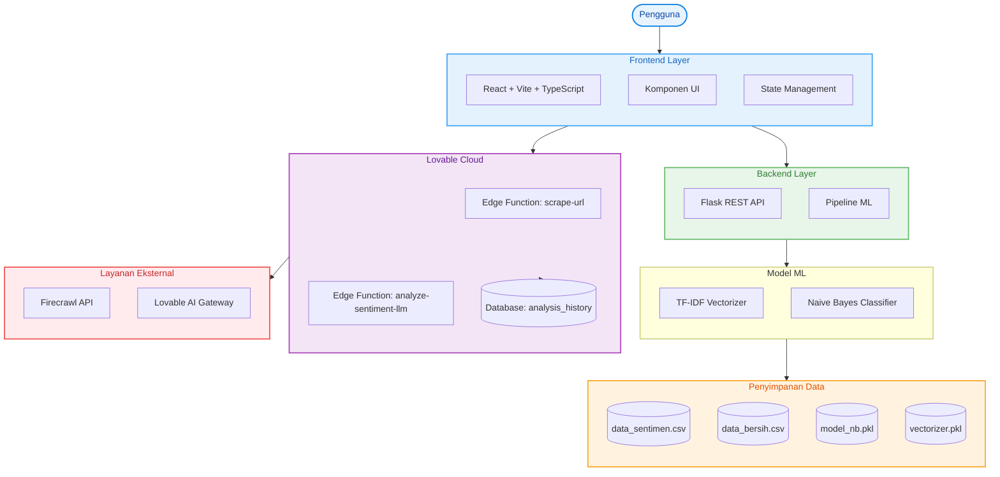

### A.2 Arsitektur Alur Data

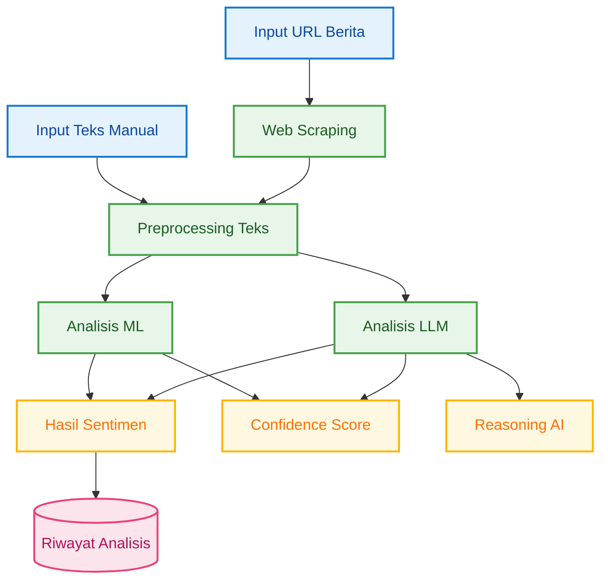

---

## 4.1.3 Entity Relationship Diagram (ERD)

### B.1 ERD Sistem Analisis Sentimen

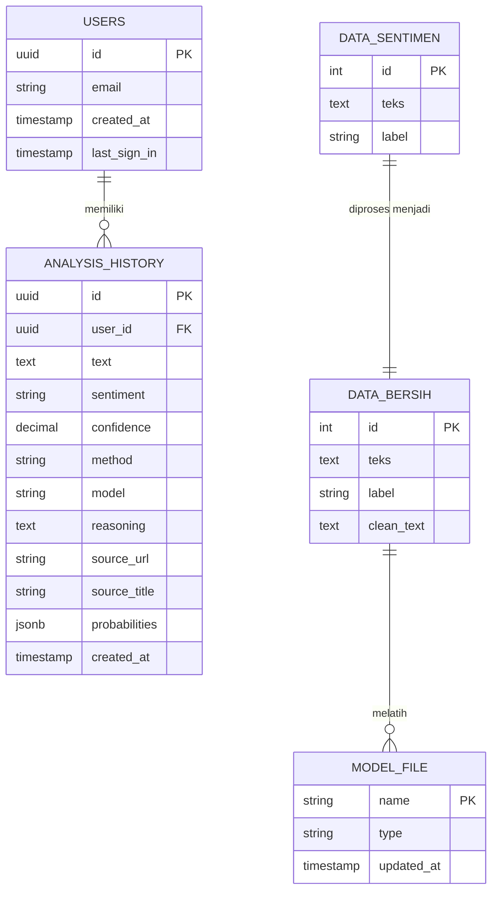

### B.2 ERD Database Cloud (analysis_history)

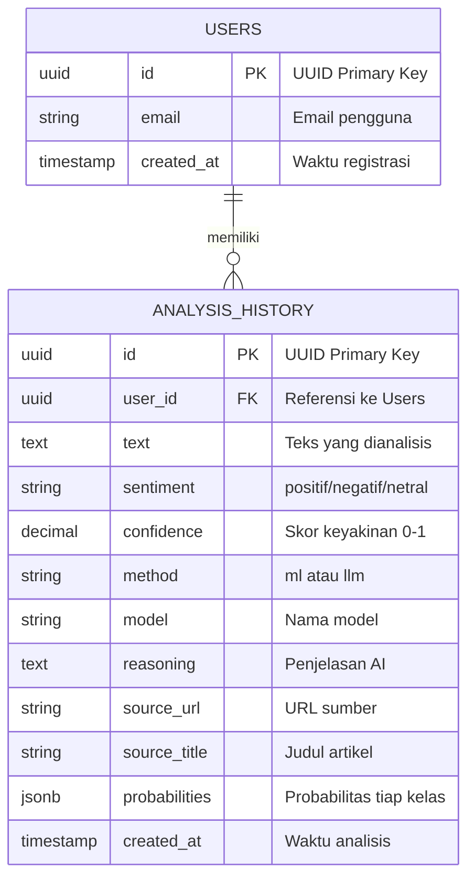

---

## 4.1.4 Use Case Diagram

### C.1 Use Case - Pengguna Umum

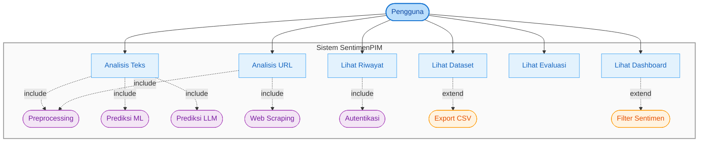

### C.2 Use Case - Administrator

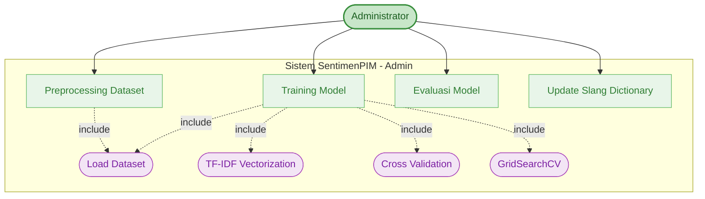

---

## 4.1.5 Activity Diagram

### D.1 Activity - Analisis Teks (Mode ML)

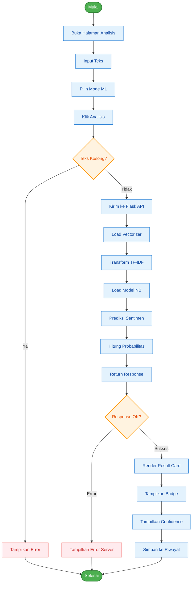

### D.2 Activity - Analisis URL (Mode LLM)

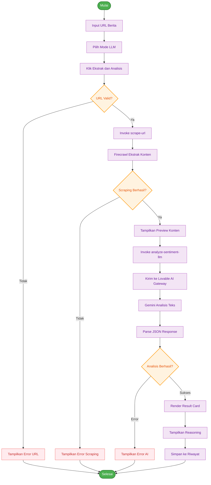

### D.3 Activity - Training Model

```mermaid
flowchart TD
    classDef startEnd fill:#4CAF50,stroke:#2E7D32,stroke-width:2px,color:#fff
    classDef action fill:#E8F5E9,stroke:#66BB6A,stroke-width:1px,color:#2E7D32
    classDef loop fill:#E1F5FE,stroke:#03A9F4,stroke-width:2px,color:#01579B
    classDef decision fill:#FFF3E0,stroke:#FF9800,stroke-width:2px,color:#E65100

    Start([Mulai]):::startEnd
    End1([Selesai]):::startEnd
    
    A1[Load data_sentimen.csv]:::action
    A2[Download NLTK Data]:::action
    
    subgraph Loop1["Loop Preprocessing"]
        L1[Ambil Baris Data]:::loop
        L2[Lowercase]:::loop
        L3[Hapus Karakter Khusus]:::loop
        L4[Tokenisasi]:::loop
        L5[Hapus Stopwords]:::loop
        L6[Normalisasi Slang]:::loop
        L7[Gabung Token]:::loop
        D1{Ada Baris Lagi?}:::decision
    end
    
    A3[Simpan data_bersih.csv]:::action
    A4[Inisialisasi TF-IDF]:::action
    A5[fit_transform X]:::action
    A6[train_test_split 80/20]:::action
    A7[Inisialisasi Naive Bayes]:::action
    A8[GridSearchCV alpha]:::action
    A9[5-Fold Cross Validation]:::action
    A10[Train dengan Best Params]:::action
    A11[Evaluasi Test Set]:::action
    A12[Simpan model_nb.pkl]:::action
    A13[Simpan vectorizer.pkl]:::action
    A14[Print Akurasi]:::action
    
    Start --> A1
    A1 --> A2
    A2 --> L1
    L1 --> L2
    L2 --> L3
    L3 --> L4
    L4 --> L5
    L5 --> L6
    L6 --> L7
    L7 --> D1
    D1 -->|Ya| L1
    D1 -->|Tidak| A3
    
    A3 --> A4
    A4 --> A5
    A5 --> A6
    A6 --> A7
    A7 --> A8
    A8 --> A9
    A9 --> A10
    A10 --> A11
    A11 --> A12
    A12 --> A13
    A13 --> A14
    A14 --> End1
```

### D.4 Activity - Dashboard Load

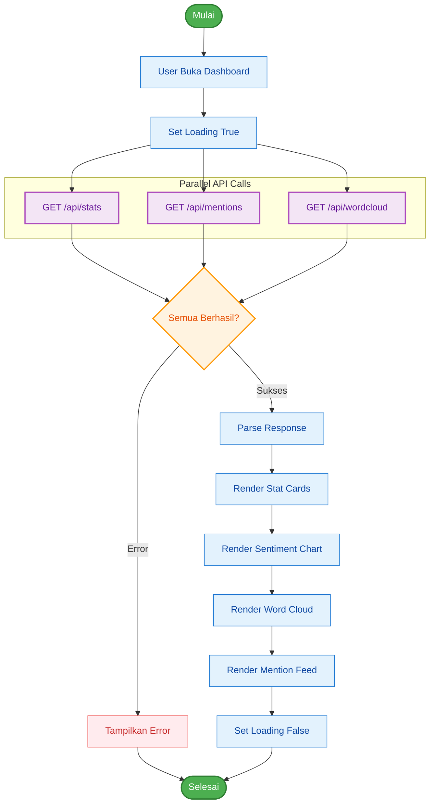

---

## 4.1.6 Sequence Diagram

### E.1 Sequence - Analisis Sentimen ML

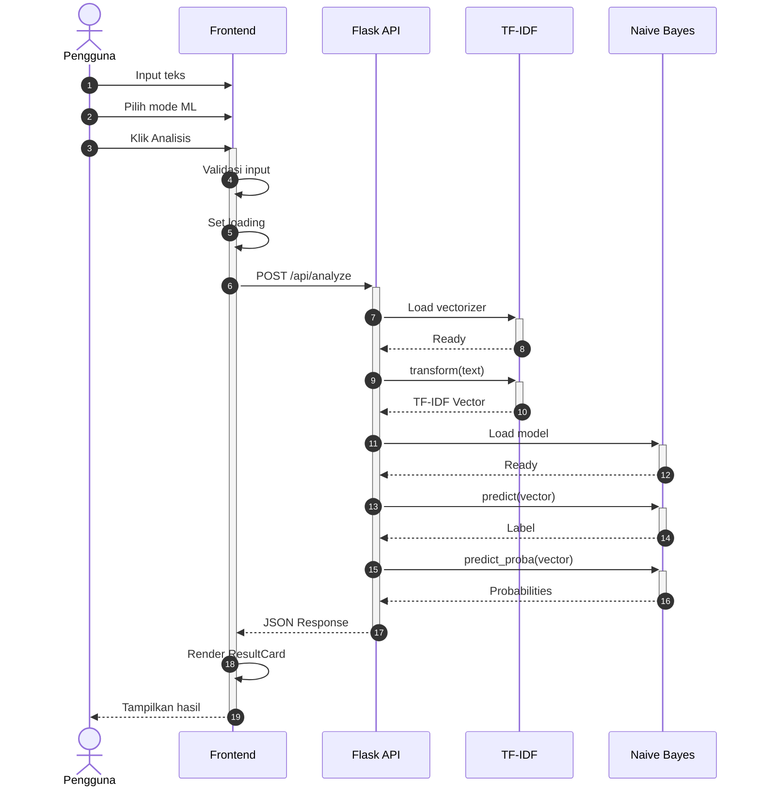

### E.2 Sequence - Analisis Sentimen LLM

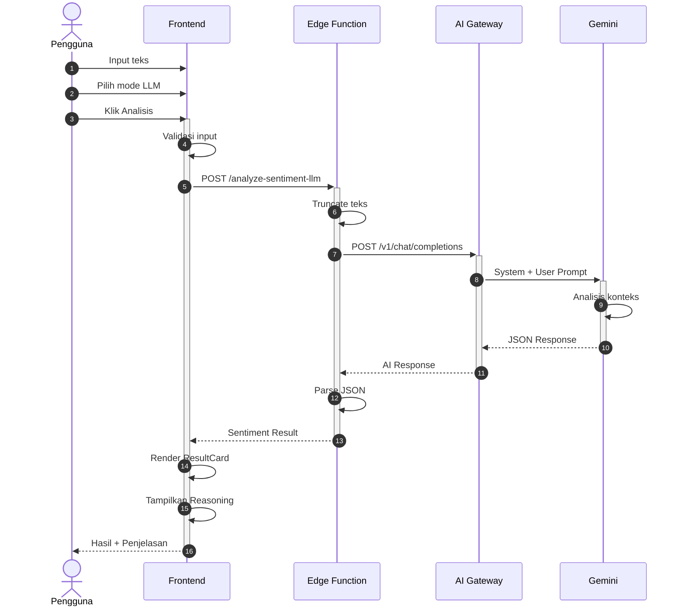

### E.3 Sequence - Analisis URL Berita

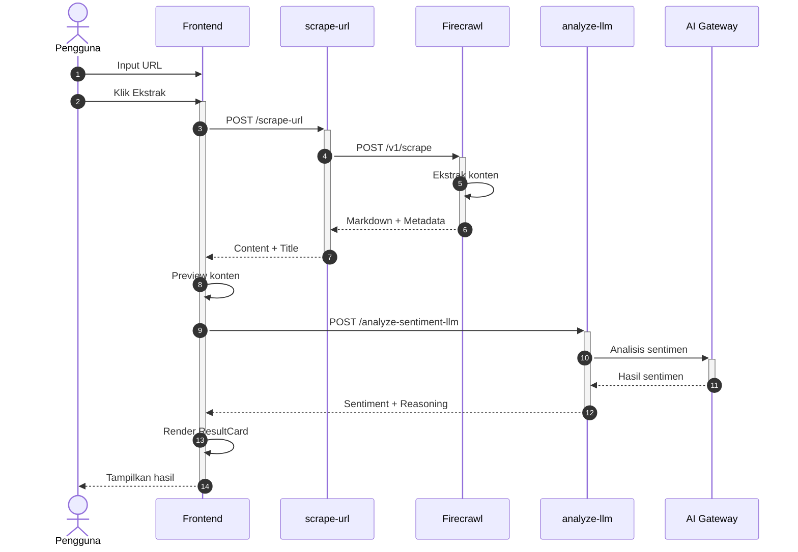

### E.4 Sequence - Simpan Riwayat Analisis

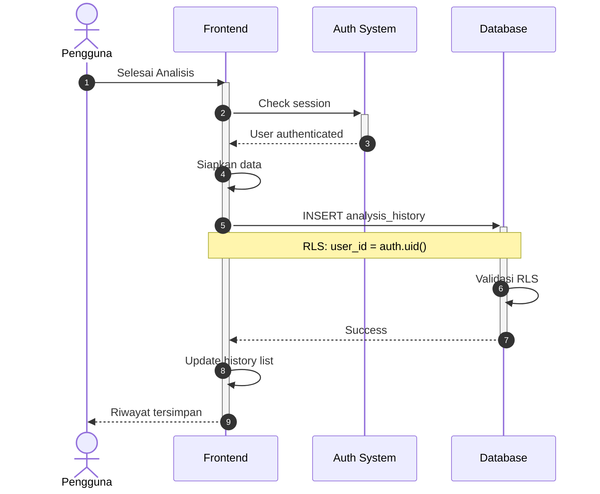

---

## Catatan Implementasi

### Skema Warna yang Digunakan

| Elemen | Warna | Kode Hex |
|--------|-------|----------|
| User/Actor | Biru Muda | #E8F4FD |
| Frontend | Biru | #E3F2FD |
| Backend | Hijau | #E8F5E9 |
| Cloud/LLM | Ungu | #F3E5F5 |
| Data Storage | Oranye | #FFF3E0 |
| External API | Merah Muda | #FFEBEE |
| Start/End | Hijau Solid | #4CAF50 |
| Decision | Oranye | #FFF3E0 |
| Error | Merah | #FFEBEE |

### Total Diagram: 14

| Kategori | Jumlah | Kode |
|----------|--------|------|
| Arsitektur Sistem | 2 | A.1, A.2 |
| ERD | 2 | B.1, B.2 |
| Use Case | 2 | C.1, C.2 |
| Activity Diagram | 4 | D.1, D.2, D.3, D.4 |
| Sequence Diagram | 4 | E.1, E.2, E.3, E.4 |

### Panduan Penggunaan

1. **Salin kode Mermaid** ke dalam dokumen Word atau LaTeX
2. **Render menggunakan**:
   - Mermaid Live Editor: https://mermaid.live/
   - VS Code Extension: Markdown Preview Mermaid Support
   - Export sebagai PNG/SVG untuk dokumen Word
3. **Sesuaikan ukuran** setelah di-render agar pas dengan margin A4
